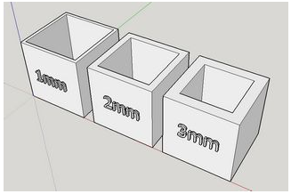
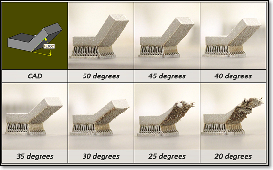
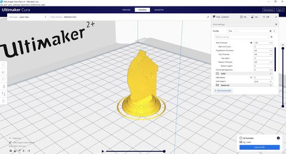
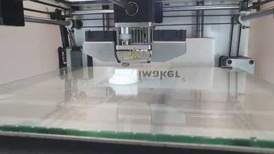
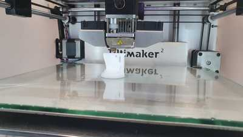
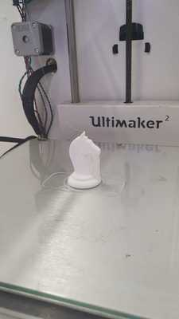

# 3D Printing
3D printing is a rapidly growing technology that will soon surpass most morden manufacturing solutions. Due to the lead time of 3D printing, it is ideal for rapid prototyping as it gives the designer the option to do quick iterations of a prototype to match the clients specifications.

Some considerations to take when designing for 3D printing.

- Layer height (extruded filament thickness)

It is the height of each layer of the 3D print, The thinner the layers, the more detail it can bring out with a smoother finish, however, the print time will be long. Ranges from 0.1~0.4mm for a 0.4 nozzle.

- Wall thickness

Controls the number of strands required for the thickness of the wall. Affects the printing time and overall strength of the final product.

- Infill percentages

It is the amount of material that fills the internal features of the 3D print. It is definitely possible to print the object as a solid product, but it will be a waste of materials and time, thus having the option to fill the cavity of the object with virtually lesser material to achieve the same result is very beneficial. Higher infills give more strength, but take longer to print. You can select different infill patterns.

- Overhang

-The limit where there is insufficient support to print angled elements. Most printers can handle an overhang of 45 deg.

- Bed adhesion

The print bed is usually heated to improve adhesion. Sometimes, the print object requires help in adhering to the print bed. Some common bed adhesion used will be, Skirt - used to outline the print base and no bed adhesion. Brims - allow some adhesion to the print perimeter. Rafts are full platforms on which the 3D print is placed. Print adhesion is onto the raft instead of the bed.

## Ultimaker Cura
In order to print a object that you have designed in the modelling software like Fusion 360. We need to use a slicing software, this will dictate the settings of our print as well as convert it into a G-code for the printer to understand and print. The printers here in FabLab@SP use a common slicing software called [Ultimaker Cura](https://ultimaker.com/software/ultimaker-cura).

These were the steps I used to create my 3D print.

1. I first converted my knight model into a STL file by going into Fusion 360 and going to Object Browser > Select Object > R-click > Save as STL.

2. Open Cura and drag the STL file into the app itself
3. At the top left bar, I configured the settings of my 3D print
4. The settings I used were Layer Height: 0.25mm, Wall Thickness: 1.05mm, Infill Density: 5%, with default support material and using a skirt for bed adhesion.
5. Click slice and the program will compute the printing time and material needed for you to print the part at your settings

6. To shorten the print time, you could increase your print speed, increase your layer height, decrease your wall thickness and decrease your infill density.
7. Save the file as a g-code, save it into a SD card and input the print into the printer.
8. After the print is finish, remove the support material and clean up the surface with various files and sand paper. And your done.

### Future Reference and Learning Points
Overall, this project was a good introduction to the world of 3D printing as I have can out of this experience with many thing I would like to improve for my future print. I should design the prototype with minimizing support material in mind as the post process is very time consuming. However, if I do need support materials, perhaps I should use custom support materials that will provide the adequate support for the overhangs and come in less contact with the print.
