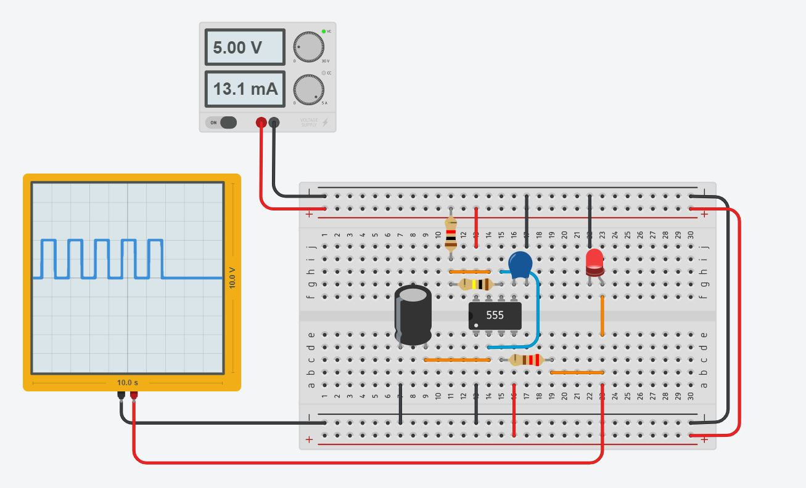
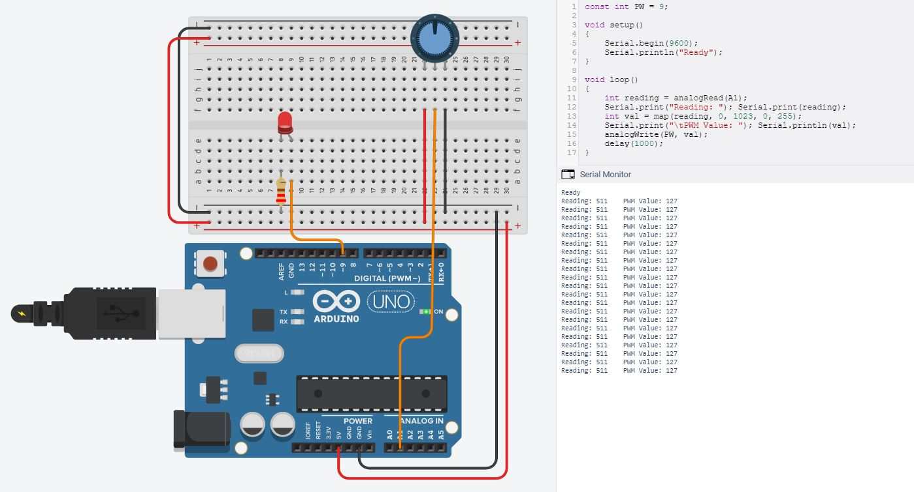

# Electronics
Learning about electronics in this module was split into 2 parts. One was a physical aspect where we got to learn how to solder components together and on tinkercad where we can design circuits and test them before wiring them up on a breadboard. This can prevent any uncertainty towards the fear of doing something wrong while doing it for the first time.

To start of with soldering. I started of with soldering our very own set of alligator clips to then ends of multi strand wire. This exercise was quite useful as not only do you learn how to prep a surface for soldering, like sanding it a little and applying a little bit of flux, but also tinning the ends of the multi strand wire so it will be easier to manipulate for soldering to the surface of the alligator clip.

The other aspect was designing circuits in tinkercad. To practice using tinkercad I constructed a simple circuit that uses a power supply to power a green led and an red led through a slider switch.

After the practice, I decided to design a Astable 555 timer in tinkercad. After some time I managed it. Tinkercad also allows you to run a simulation of your design to test any bugs that it might have and thus after testing, it worked. I then moved on to wiring it up on an actual breadboard and it worked.

# Arduino
Arduino is an open-source electronics platform based on both hardware and software. The hardware consist of the Arduino UNO(a microcontroller), resistors, wires, LEDs, buttons etc. whereas the software is the Arduino IDE, an application to program the electronics.

To learn more about how the Arduino coding works, I used tinkercad to design some simple circuits and coded them to work with the intelligence of the Arduino.

## TASK 1: Simple LED Blink

## TASK 2: Push Button to Turn on LED

The important thing to note was the way the LED cathode and anode where at in relation to Ground (GND) and 5v.

# Input Devices
Input devices are often called Sensors. Output devices are often called Actuators. The process of connecting a Sensor or Actuator to a computer processor system is called Interfacing.

An example of an input device will be using a push button switch. This specific example will be using the push button switch to toggle between the states of the red and green leds from; BOTH OFF, RED ON GREEN OFF, RED OFF GREEN ON and BOTH ON. I first designed the circuit in tinkercad and coded it so it will interface properly. After the simulations were working, I transferred it to the actual arduino and it worked the same.

## Toggle Push Button Input

## Potentiometer Input

Another example of a input device is using a potentiometer to vary the brightness of a LED. This was what I came up with.

# Output Devices
Output devices are often called Actuators. An Actuator is a component that moves or controls movement. We use output devices to display information or move mechanisms.

## RGB Output

The example of an output device I am showing here will be how a RGB LED, the output interfaces with the different light values that is obtained through the analog from a Light Dependent Resistor (LDR). Similar process to the input toggle, I designed the circuit in tinkercad, coded it and then after a successful simulation transferred it to the actual arduino, wired it up and it worked.

