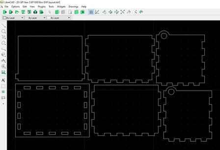

# Laser Cutting
Laser cutting is where material like wood or acrylic are placed on a horizontal plane and a laser moves and focuses on a point to cut (vaporized) the material with precision.

The process of laser cutting is controlled by:
- SPEED
Slow speeds allow the laser more time over the material and cuts deeper and more intensely.
Slow speeds also cause charring of the material.
- POWER
Higher intensities of the laser can cut deeper
Higher intensities are sometimes required as the material is more dense than others
- FREQUENCY
Most lasers are pulsed. The higher the number of pulses per second give higher intensities and prolonged exposure to the laser.
Higher pulsing rates are required for dense material

For this project, I will be trying to laser cut the box that I have designed in Fusion 360.


1. Create a new sketch of surface that you want to laser cut in Fusion 360, and click finish sketch. Proceed with this step with all the surfaces you wish to laser cut. In the sketches tab, right click each sketch and save it as a DXF file.

2. Open [LibreCAD](https://librecad.org/) and start a new drawing, File > New. Use File > Import > Block and select your DXF file. Add all of the files you saved from step 1.
3. Make sure to arrange the to be as compact as possible. This step can be done later using CorelDraw Graphics but I chose to do it here.
4. After arranging your profiles, save the file as a another DXF file.

5. Import the DXF file into CorelDraw. Create a new CorelDraw file using the default template. File > Import > Select LibreCAD DXF file. Make sure you are using Metric and 1:1 Scaling. Select the lines that are meant to be cut as "Hairline".
6. When you are ready to print, Click print and configure the Power, Speed, Frequency.
7. Load the material into the laser cutter and ensure that there is enough room for you to cut out the piece.
8. After cutting, assemble the pieces together and you have the project you designed in the CAD software, Fusion 360.

