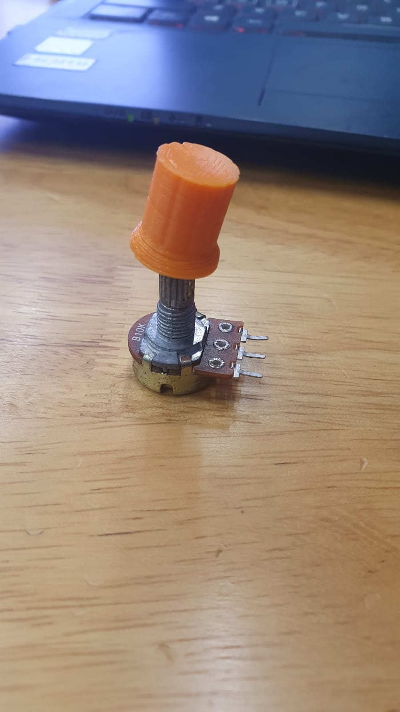

# Final Project

## Concept

I tend to lag when I am playing computer games and I have no reliable way to monitor my computers temperature or change the fan speed to accommodate for the rise in temperature when I am playing games. Thus, the concept of this project is to design a system to change the speed of a fan to in relation to the temperature of my laptop.


|Project |Temperature Sensing Laptop Cooler |
|--------|-------------|
|Purpose|To keep my laptop at a low temperature when I am playing games or using it to do work. Preventing it from overheating.|
|Laser Cutting|Frame of Laptop Stand, Fan mounting|
|3D Printing|Knob for Potentiometer|
|µC Input|Detect the increase in temperature from bottom of laptop using LM35, Potentiometer for manual control|
|µC Output|Control Speed of fans (Temperature)|
|To Buy|CPU cooling fan (12v)/DC fan, LM35 Sensor, Push button switch, Potentiometer, L298N (H-bridge)|


## Bill of Materials

This is the list of materials I would need to make this project.

|S/No |Description |Unit Cost |Quantity |Total Cost |Remarks |
|--------|-------------|-------------|--------|-------------|-------------|
|1|Push Button Switch|$0.00|1|$0.00|Provided by SP FabLab|
|2|LM35 Sensor|$0.00|1|$0.00|Provided by SP FabLab|
|3|Potentiometer|$0.00|1|$0.00|Provided by SP FabLab|
|4|Arduino Uno|$0.00|1|$0.00|Provided by SP FabLab|
|5|12v DC Computer Cooling Fan|$0.00|1|$0.00|Provided by SP FabLab|
|6|H-Bridge (L298N)|$0.00|1|$0.00|Provided by SP FabLab|
|7|M3 Screw and Nut|$0.00|4|$0.00|Provided by SP FabLab|
|8|Red and Green LEDs|$0.00|2|$0.00|Provided by SP FabLab|
|9|7805 Voltage Regulator|$0.00|1|$0.00|Provided by SP FabLab|
|10|5mm thick Wood|$0.00|1|$0.00|Provided by SP FabLab|

## Designing in CAD software
Using Fusion 360, I modelled up a generic laptop stand design. Some issues with the design were later more prevalent as I made a cardboard mock up of it to check and see the dimensions.


Laser Cut Mock Up:
The height was too large. The viewing angle of 22 degrees seem too high and the side panel legs was in the way of hands for typing.
- Lowered the viewing angle to 18 degrees and reduced the height of the legs for a more compact design.
- Added holes for mounting the fan


## Laser Cut and 3D Print

3D Print Knob:
I decided to design a knob so it will be easier for the user to turn the potentiometer. For more ease of use.




First Print was not successful. The hole to fit over the potentiometer was too small and The overall size was small for a knob.
- Changed the size of the 6mm hole inside to 6.1mm.
- Increased the overall size of the knob by 2.
- Added slot in the middle as registration to fit over Potentiometer


After finalizing the dimensions of the frame of the laptop cooler, I proceeded to load the final layout in LibreCAD and bring it to CorelDraw to finally laser cut the design.


I decided to go for 5mm thick wood as the other thicknesses available where too thin to support a laptop for long periods of time. Acrylic may tend to warp when under prolong heat. Thus, the 5mm thick wood was the logical choice.

After cutting the pieces out, I realized that I needed holes for the LEDs and I was running out of time. So I decided to drill out the holes for the LEDs using a hand drill. I also countersunk the screw holes for fans as I needed the top surface to be flush so as to not scratch the laptop every time I place it on the cooler.


## Electronics
Mocking up the electronics, I made up a schematic in tinkercad to visualize what I need for each electronic component and to see if my circuit designed worked with my code. This was what i can up with.

I first decided to use a H-Bridge to drive the 12v fans. Along with using a push button switch to toggle between the automatic mode (LM35) and the manual mode using the potentiometer. The red and green LEDs are to indicate which mode the system is currently in. Red being manual and green being automatic.


Due to the fact that some of my electronics are mounted on the side panel of the laptop stand, I needed to solder extension wires to the leads of these electronics. After which I mounted it on the side panel.


The supplier for the fan did not deliver the fan in time for the project due date so I decided to use one fan as a proof of concept for this prototype.

Wiring the electronics for this project was surprisingly daunting for someone doing it for the first time. I needed a motor driver to control the speed if the fans and so I decided to use a L298N H-bridge that can fulfill my At first I used a mini version of an L298N. The problem was the mini L298N only used 9 volts and cuts off at 10 volts thus it could not take the 12 volt supply. Thus, I switched to the bigger version of the L298N and it managed to work.


Additionally, I used a 7805 voltage regulator so I can power my Arduino Uno and my 12v fan at the same time.


## Code used for the Arduino

```html
#define Pot A0
#define LM35 A1
#define enA 9
#define IN1 6
#define IN2 7
const int tempMin = 30;
const int tempMid = 45;
const int tempMax = 60;
const int redLED = 13;
const int greenLED = 12;
const int PSW = 3;
int oldspeed = 0;
bool pot=0;
bool heat=1;

int state;
int lastSWState;

void setup(){
  pinMode (redLED, OUTPUT);
  pinMode (greenLED, OUTPUT);
  pinMode (PSW, INPUT);
  Serial.begin(9600);
  Serial.println("Motor control");
  pinMode(Pot,INPUT);
  pinMode(LM35,INPUT);
  pinMode(enA,OUTPUT);
  pinMode(IN1, OUTPUT);
  pinMode(IN2, OUTPUT);
  digitalWrite(IN1, LOW);
  digitalWrite(IN2, HIGH);

  state = 0;
  lastSWState = HIGH;
  digitalWrite (redLED, LOW);
  digitalWrite (greenLED, LOW);

  digitalWrite (IN1, LOW);
  digitalWrite (IN2, HIGH);
}


void loop(){
  int reading = digitalRead(PSW);
    if (reading == LOW){
      if (lastSWState == HIGH){
        state += 1;                       //next state
        if (state == 2) state = 0;        //only 2 states 0..3

        switch(state){
          case 0:{
            digitalWrite (redLED, HIGH);
            digitalWrite (greenLED, LOW);
            pot=0;
            heat=1;
          }break;
          case 1:{
            digitalWrite (redLED, LOW);
            digitalWrite (greenLED, HIGH);
            pot=1;
            heat=0;
          }break;
        }
        lastSWState = LOW;
      }

    }
    else{
        lastSWState = HIGH;
      }

  if(heat ==1){
            int reading =(analogRead(LM35));
            Serial.print("Analog = ");
            Serial.println(reading);
            float mv = (reading/1024.0)*5000;  
            float cel = mv/10;
            Serial.print("Temperature = ");
            Serial.println(cel);
            delay(1000);

            if (cel < tempMin){
              analogWrite(enA, LOW);
            }
            else if (cel > tempMin && cel < tempMid){ //Fan 50%
              analogWrite(enA, 128);
            }
            else if (cel > tempMid && cel < tempMax){ //Fan 75%
              analogWrite(enA, 178);
            }
            else { //Fan 100%
              analogWrite(enA, 255);
            }
  }

  if (pot==1){
            int reading = analogRead(Pot);
            Serial.print("Analog: ");
            Serial.println(reading);
            int speed = map(reading,0,1023,0,255);
            // mapping from larger variance to smaller range
            if (speed != oldspeed){
              analogWrite(enA, speed);
              oldspeed = speed;
              }
            delay(1000);
  }

}
```
Because of time constraints and the supplier not being able to deliver the second fan in time. This code only includes control for 1 fan. However adding control for a second fan is quite easy as you only need to add a few things. This is what the code may look like if you were to use 2 motors.

```html

#define Pot A0
#define LM35 A1
#define enA 9
#define IN1 6
#define IN2 7
#define IN3 (any avaliable PWM Pin on Arduino)
#define IN4 (any avaliable PWM Pin on Arduino)
#define enB (any avaliable PWM Pin on Arduino) //Enable Pin B on L298N
const int tempMin = 30;
const int tempMid = 45;
const int tempMax = 60;
const int redLED = 13;
const int greenLED = 12;
const int PSW = 3;
int oldspeed = 0;
bool pot=0;
bool heat=1;

int state;
int lastSWState;

void setup(){
  pinMode (redLED, OUTPUT);
  pinMode (greenLED, OUTPUT);
  pinMode (PSW, INPUT);
  Serial.begin(9600);
  Serial.println("Motor control");
  pinMode(Pot,INPUT);
  pinMode(LM35,INPUT);
  pinMode(enA,OUTPUT);
  pinMode(IN1, OUTPUT);
  pinMode(IN2, OUTPUT);
  digitalWrite(IN1, LOW);
  digitalWrite(IN2, HIGH);
  pinMode(enB,OUTPUT);
  pinMode(IN3, OUTPUT);
  pinMode(IN4, OUTPUT);

  state = 0;
  lastSWState = HIGH;
  digitalWrite (redLED, LOW);
  digitalWrite (greenLED, LOW);

  digitalWrite (IN1, LOW); //determine fan direction
  digitalWrite (IN2, HIGH);
  digitalWrite (IN3, LOW);
  digitalWrite (IN4, HIGH);
}


void loop(){
  int reading = digitalRead(PSW);
    if (reading == LOW){
      if (lastSWState == HIGH){
        state += 1;                       //next state
        if (state == 2) state = 0;        //only 2 states 0..3

        switch(state){
          case 0:{
            digitalWrite (redLED, HIGH);
            digitalWrite (greenLED, LOW);
            pot=0;
            heat=1;
          }break;
          case 1:{
            digitalWrite (redLED, LOW);
            digitalWrite (greenLED, HIGH);
            pot=1;
            heat=0;
          }break;
        }
        lastSWState = LOW;
      }

    }
    else{
        lastSWState = HIGH;
      }

  if(heat ==1){
            int reading =(analogRead(LM35));
            Serial.print("Analog = ");
            Serial.println(reading);
            float mv = (reading/1024.0)*5000;  
            float cel = mv/10;
            Serial.print("Temperature = ");
            Serial.println(cel);
            delay(1000);

            if (cel < tempMin){
              analogWrite(enA, LOW);
            }
            else if (cel > tempMin && cel < tempMid){ //Fan 50%
              analogWrite(enA, 128);
			  analogWrite(enB, 128);
            }
            else if (cel > tempMid && cel < tempMax){ //Fan 75%
              analogWrite(enA, 178);
			  analogWrite(enB, 178);
            }
            else { //Fan 100%
              analogWrite(enA, 255);
			  analogWrite(enB, 255);
            }
  }

  if (pot==1){
            int reading = analogRead(Pot);
            Serial.print("Analog: ");
            Serial.println(reading);
            int speed = map(reading,0,1023,0,255);
            // mapping from larger variance to smaller range
            if (speed != oldspeed){
              analogWrite(enA, speed);
		      analogWrite(enB, speed);			 
              oldspeed = speed;
              }
            delay(1000);
  }

}
```

## Testing

Testing the prototype was a little time consuming at the start as I did not realize the mini L298N could only take 9v and thus, only when I changed it to the big one. It worked with 12v. Other than that, the sub systems of the toggling function, LED indicators worked smoothly with no hiccups.

## Results

<iframe width="560"
        height="315"
        src="https://youtu.be/WhZLdxxuaM8"
        frameborder="0"
        allow="autoplay; encrypted-media"
        allowfullscreen></iframe>


## Conclusion

What conclusions can you draw from your final project? What are the issues/problems encountered? How did you resolve them? What are the improvements that can be made to your project?

## Design files & Source Code

Download Here: [coolerframe.f3d](coolerframe.f3d)



Download Here: [knob.f3d](Knob.f3d)


