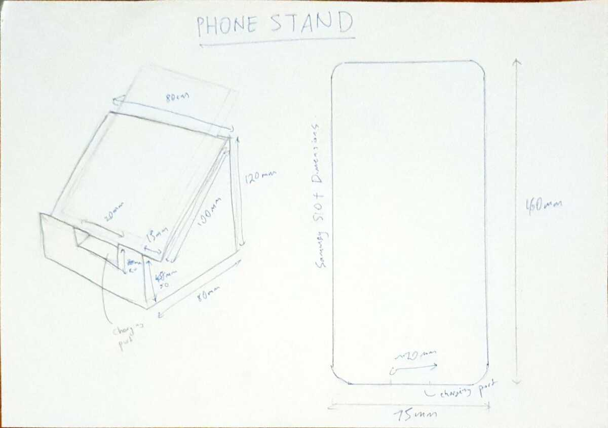
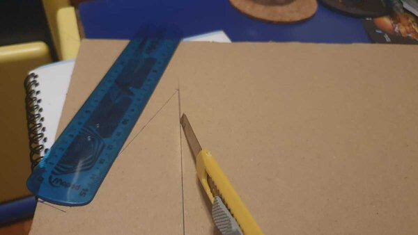
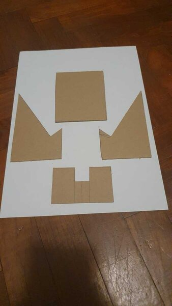
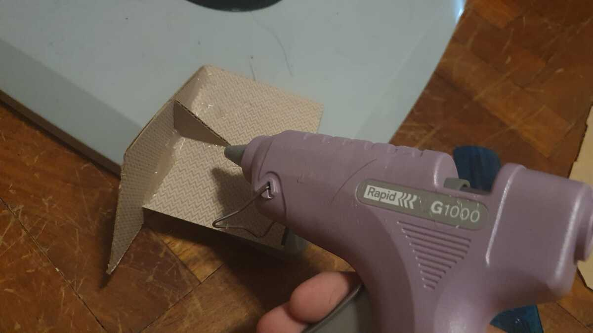
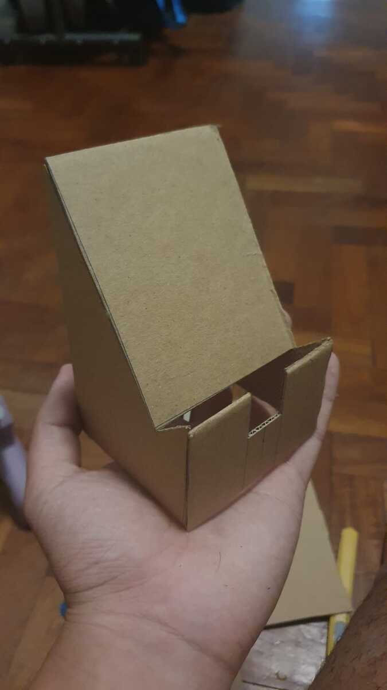
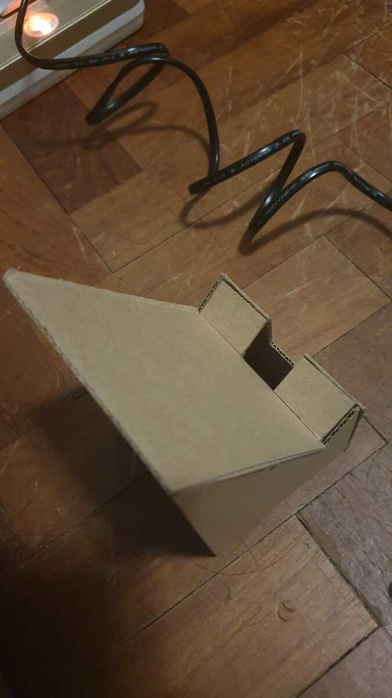
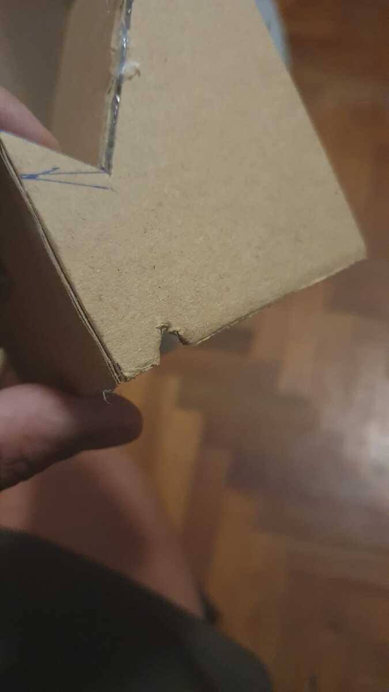
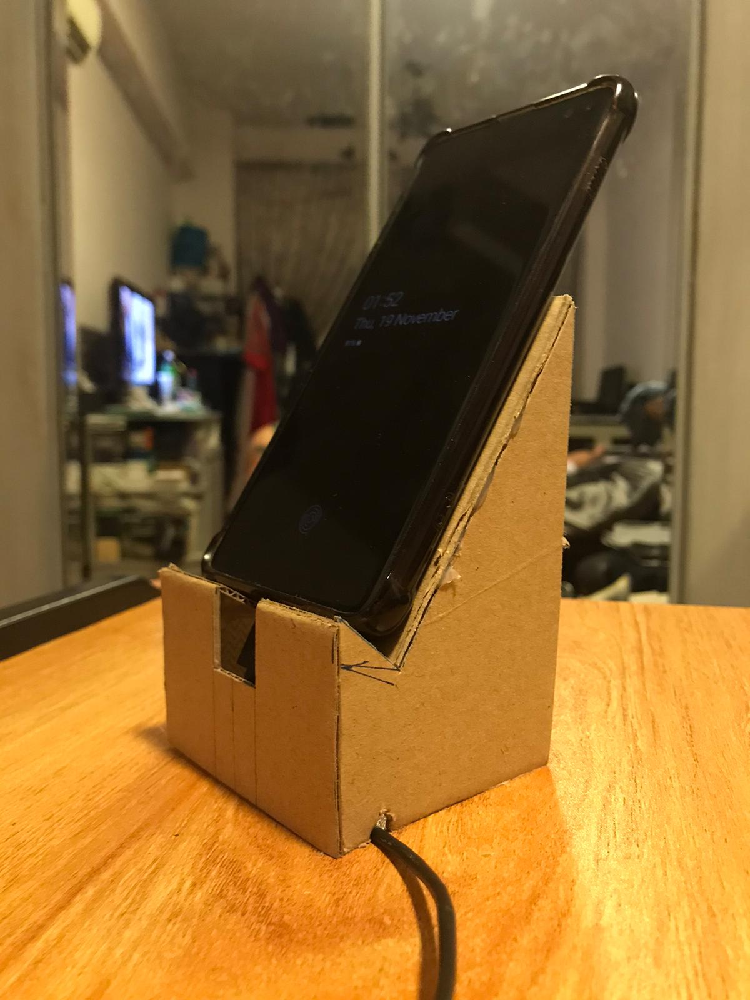
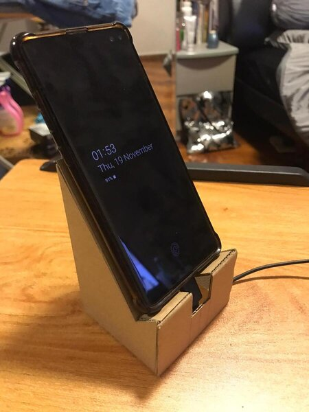
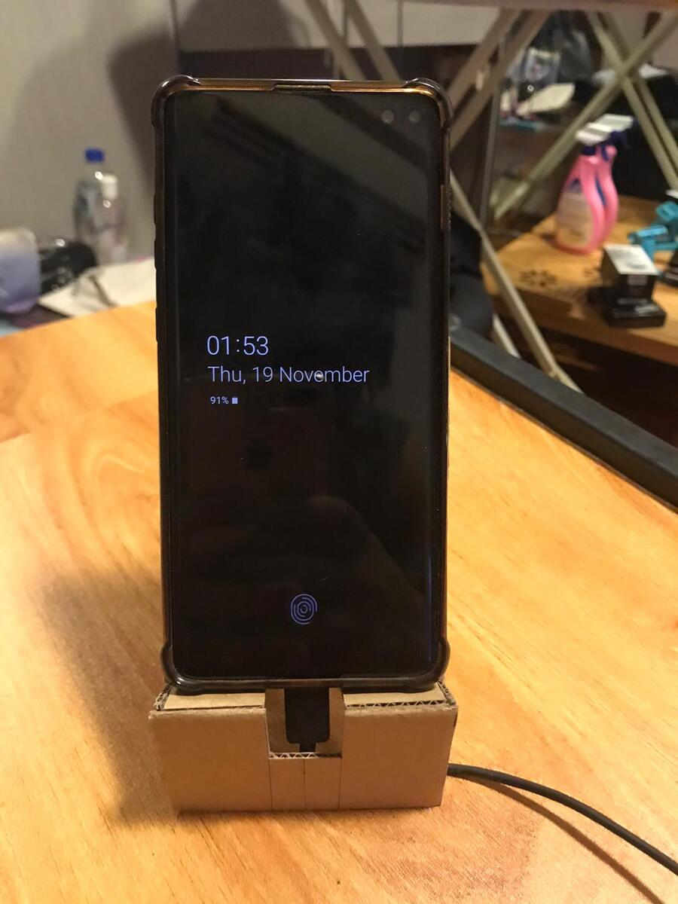

# Learning prototyping
Taking a first dive into prototyping, I started with a simple project. A phone stand. Here are some of the steps i took for this undertaking.

1. I started by drawing out a design for my phone stand on a piece of paper. I added some dimensions i feel that can fit my phone (Samsung S10+).

2. After I finalize the dimensions of the phone stand. I drew it out on cardboard and cut it out using a box cutter.

3. To assemble the part, I used a hot glue gun to attach the parts together. I added a gusset for more stability and rigidity.

4. After doing the initial assembly, I realised that it needed to have a platform to hold the phone and so I cut out and glued some extra platforms for the phone to sit on.

 

5. The final adjustment done was to cut a small notch by the side of the phone stand. This was to accommodate the charging cable from interfering with the bottom of the phone stand so it would sit flush with the table.

## Final Product

* * *

## Learning points
It was a fun first hands experience to be able to see the final product I made right after I sketched it out. this exercise made me respect hot glue a little more now as I accidentally touched the hot glue when it was hot and now have a slight burn. Holding the pieces at the 90 degree angle while the glue was drying was tough so adding the gusset was also to facilitate the process. Suprisingly the cutting of the cardboard was not as scary as I recalled. What I did was to do three passes to cut one edge to ensure the cut is clean and straight. All in all, I would say that this was a wonderful experience and would recommend anyone interested to try something like this yourself.
